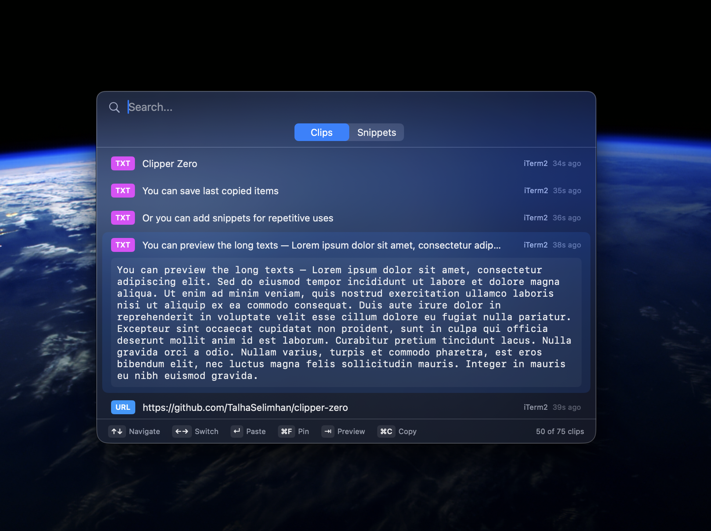

# Clipper Zero

A lightweight, keyboard-driven clipboard history manager for macOS. Lives in your menu bar, captures everything you copy, and lets you recall it instantly with a single shortcut.




## Features

- **Clipboard History** — Automatically captures text, rich text, images, files, URLs, and colors. Duplicates are deduplicated.
- **Snippets with iCloud Sync** — Save frequently used text and access it across all your Macs.
- **Keyboard-First** — `Cmd+Shift+V` opens the panel, arrow keys navigate, `Enter` pastes.
- **Privacy Controls** — Exclude sensitive apps like 1Password from clipboard capture. No telemetry.
- **Menu Bar Quick Access** — Browse recent and pinned clips from the menu bar dropdown.
- **Auto Updates** — Sparkle-powered updates with code-signed releases.

## Keyboard Shortcuts

| Shortcut | Action |
|---|---|
| `Cmd+Shift+V` | Toggle panel |
| `Up/Down` | Navigate items |
| `Left/Right` | Switch Clips / Snippets |
| `Enter` | Paste selected item |
| `Tab` | Expand preview |
| `Cmd+F` | Pin / Unpin clip |
| `Cmd+C` | Copy without pasting |
| `Cmd+N` | New snippet |
| `Cmd+Delete` | Delete item |
| `Esc` | Close panel |

## Installation

Download the latest DMG from [GitHub Releases](https://github.com/TalhaSelimhan/clipper-zero/releases), open it, and drag Clipper Zero to Applications.

On first launch, grant **Accessibility** permission when prompted (required for the global hotkey and paste injection).

## Requirements

- macOS 14.0 (Sonoma) or later
- iCloud account for snippet sync (optional)

## Building from Source

```bash
git clone https://github.com/TalhaSelimhan/clipper-zero.git
cd clipper-zero
open clipper-zero.xcodeproj
```

Build and run the `clipper-zero` scheme. You'll need your own signing identity and iCloud container for CloudKit features.

## License

MIT
